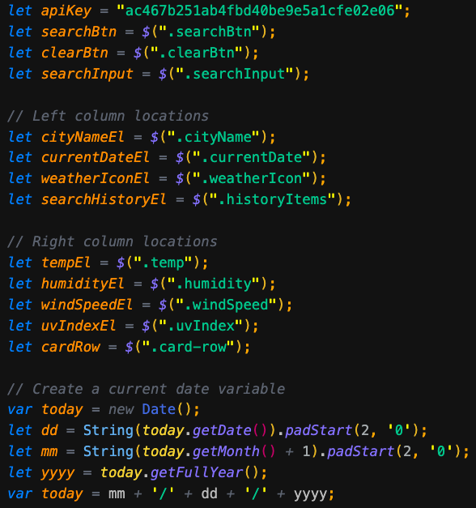
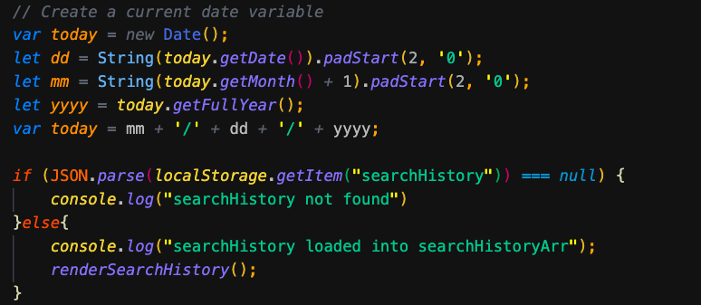
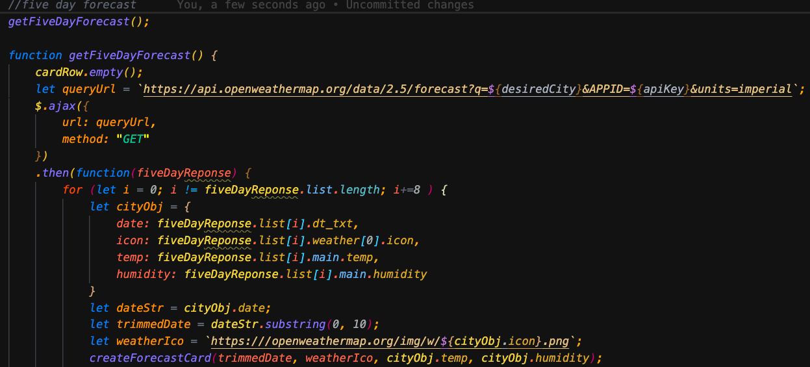
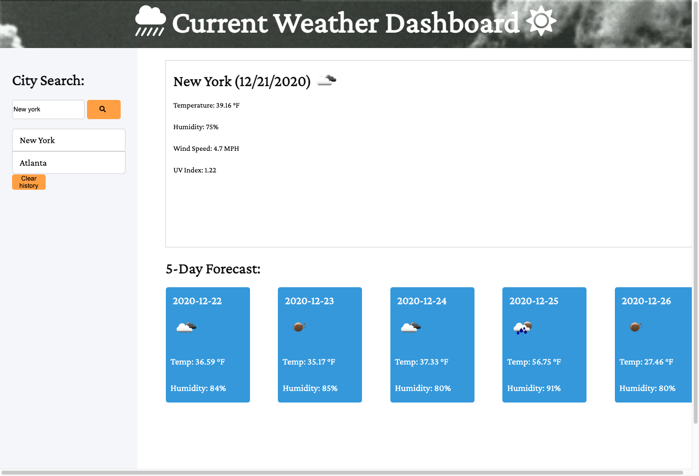

###**Weather-Dashboard-API**###


*This application was created to find a weather condition of a given city both the current and 5-Days forecast at the same time.
The server-side API used to get response data object is retrieved from the Open Weather APi.

###**This Application Includes**###
* City, Date, Icon-image
* Temperature
* Humidity
* Wind Speed
* UV index
* I used local storage here to retain the previous search city and display them to the user in the left side of the page under the list group. The user can also clear the search history by clicking the clear history button.

###**Acceptance Criteria**###
```
GIVEN a weather dashboard with form inputs
WHEN I search for a city
THEN I am presented with current and future conditions for that city and that city is added to the search history
WHEN I view current weather conditions for that city
THEN I am presented with the city name, the date, an icon representation of weather conditions, the temperature, the humidity, the wind speed, and the UV index
WHEN I view the UV index
THEN I am presented with a color that indicates whether the conditions are favorable, moderate, or severe
WHEN I view future weather conditions for that city
THEN I am presented with a 5-day forecast that displays the date, an icon representation of weather conditions, the temperature, and the humidity
WHEN I click on a city in the search history
THEN I am again presented with current and future conditions for that city
WHEN I open the weather dashboard
THEN I am presented with the last searched city forecast
```

### **Code Samples** ###

**variables**

**Current_day**

**5-Day Forecast**



### **Deployed Site Screenshot** ###



[Click here to view published site] or (https://danielthomas129.github.io/Weather-Dashboard-API/)
[Click here to view Github Repository] or (https://github.com/danielthomas129/Weather-Dashboard-API)